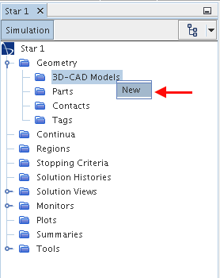

# StarCCM+ Tutorial

Outline for creating a transient unsteady turbulent simulation:
1. Define Geometry
2. Define Physics Continua
3. Create Mesh
4. Run simulation
  * Super Computer
5. Visualization

## Setup
### Opening StarCCM+
#### Mac Mini (must have supercomputer account)
1. Open Terminal
2. `ssh -X username@ssh.fsl.byu.edu`
3. Enter Password
4. `module load starccm+/11.04.010`
5. `starccm+`

#### WorkStation (Locally)
1. Open Terminal
2. `cd ~/Programs`
3. `./openstar.sh`

### Creating New simulation
1. Ctrl + N
2. Click "Parallel on Local Host"
3. Set "Compute Processes: " to 8

4. Click "OK"
5. Save simulation
## Defining Geometry
In Simulation Tree:
1.  Right Click on Geometry > 3D-CAD Models and select "New"

2.
3.
4.
* Motion too
  * Create all Geometry
  * Name all parts and surfaces
  * New geometry parts
  * Subtractions (under Geometry>operations>create subtract)
  * Assign parts to region ( for subtracts)
* Designate boundary conditions and interfaces

## Define Physics Continua

## Create Mesh

## Run simulation

## Visualization
